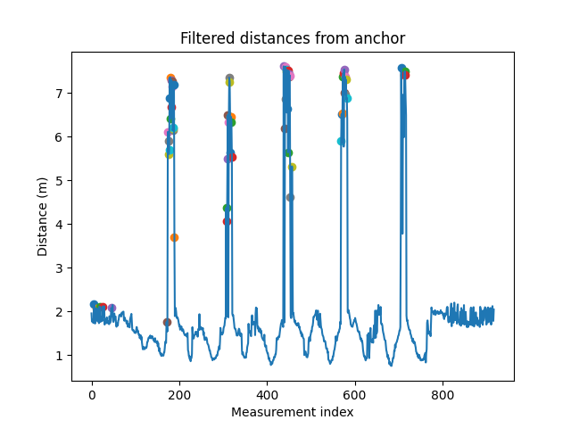
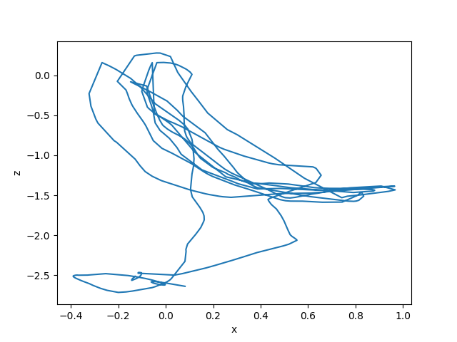
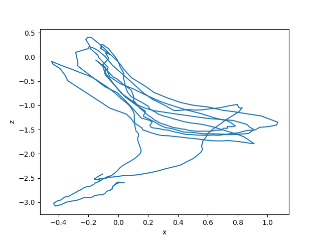
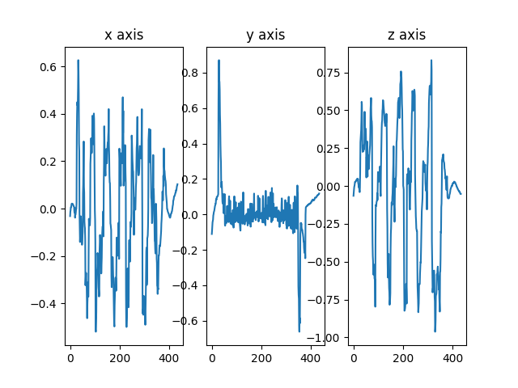
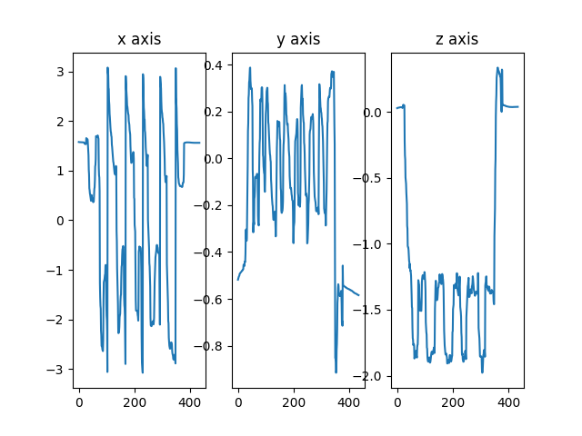

# UWB-IMU fusion for robust cost-effective trajectory estimation

## Problem
Goal is to explore the possibility of accurate trajectory estimation in order to compute the desired statistics during sporting activities. To that end, sensor setup is required to be lightweight and includes only a simple IMU and UWB DW1000 transceiver. 

System receives ToF measurements from 6 **unsynchonized** UWB anchors. Range measurements are then calculated via Two-Way Ranging (TWR). Compared to synchronous approach, this induces a large percentage of outliers and measurement errors.

## Requirements
- Numpy
- [Gtsam (including python bindings)](https://github.com/borglab/gtsam)

Measurements of simple testing trajectories are provided in [measurements/](measurements/).

Running main.py will produce results for loosely-coupled and tightly-coupled approach.

## Method
Since there is no real-time requirement, data is first pre-processed in order to clean erronous outliers. Outliers are first detected via constant velocity and Hampel filters for all 6 anchors, netting accurate outlier detection:

Trajectory optimization problem is modelled via commonly used factor-graph formulation, enabling nonlinear MAP inference.
[smoothers.py](smoothers.py/) contains implementation of smoothers via [iSAM2 algorithm](https://doi.org/10.1109/ICRA.2011.5979641), using [on-manifold preintegration](https://doi.org/10.1109/TRO.2016.2597321) for IMU fusion. Smoother infers MAP estimate for a posterior density of all unknown states in the trajectory, i.e., $p(X_1, ..., X_N | Z_1, ... Z_N)$. This is generally more accurate than filters, which perform recursive estimation via marginalization, i.e., $p(X_N | Z_1, ... Z_N)$.

Two smoothers are implemented:
- **Loosely coupled smoother** - UWB measurements are preprocessed via **robust RANSAC mutlilateration**, obtaining position estimates before fusion with IMU
- **Tightly coupled smoother** - UWB range measurements are directly used in factor-graph optimization problem

These 2 approaches result in following trajectories:

Besides 3D position, estimator also optimizes velocities and 3D rotations

Additionally, [filters.py](filters.py) contains implementation of loosely and tightly-coupled EKFs with constant velocity model for comparison purposes.

